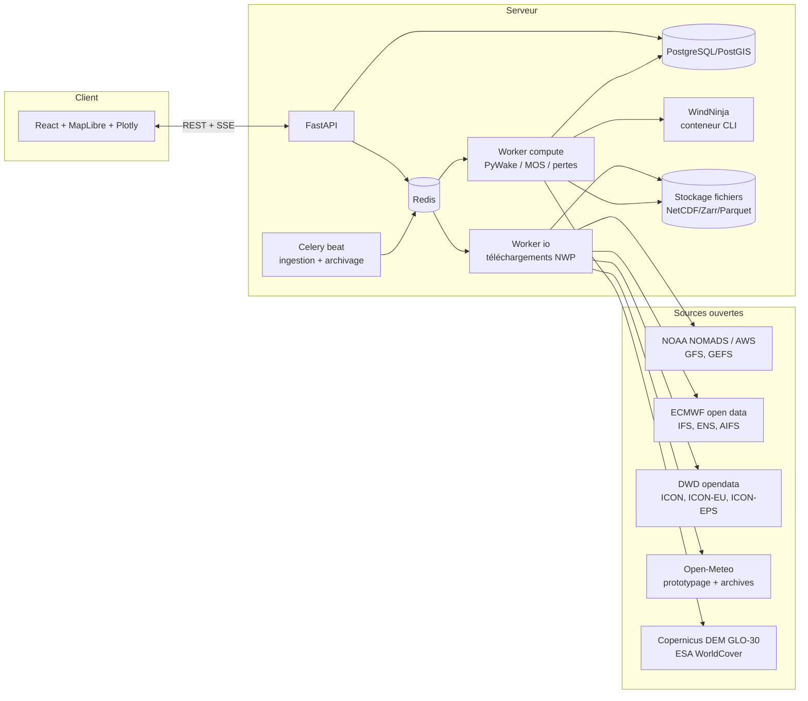
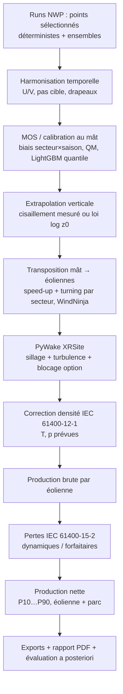
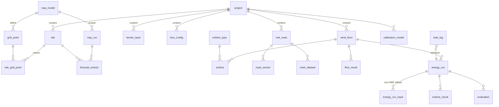

# Note d'architecture — Greenard

> Application web de prévision météorologique (Module A « Météo ») et de prévision de production éolienne (Module B « Énergie »).
>
> Version 0.1 — 2026-09-22 — **en attente de validation**. Aucun code applicatif n'est écrit avant votre accord sur cette note ; les points à trancher sont regroupés en §11.

---

## Sommaire

1. [Principes directeurs](#1-principes-directeurs)
2. [Stack technique retenue et justification](#2-stack-technique-retenue-et-justification)
3. [Vue d'ensemble : services et flux](#3-vue-densemble--services-et-flux)
4. [Module A — Météo](#4-module-a--météo)
5. [Module B — Énergie](#5-module-b--énergie)
6. [Schéma de base de données](#6-schéma-de-base-de-données)
7. [API REST (esquisse)](#7-api-rest-esquisse)
8. [Exigences transversales](#8-exigences-transversales)
9. [Stratégie de tests](#9-stratégie-de-tests)
10. [Plan de jalons](#10-plan-de-jalons)
11. [Limites identifiées et décisions à valider](#11-limites-identifiées-et-décisions-à-valider)

---

## 1. Principes directeurs

| Principe | Conséquence concrète |
|---|---|
| **Honnêteté des données** | Chaque valeur d'une série temporelle porte un drapeau `native` / `interpolated` et le nom de la méthode. Rien n'est « lissé » en silence. |
| **Données brutes des modèles** | En production, les valeurs viennent du point de grille lui-même (GRIB natif), sans la réduction d'échelle implicite appliquée par certaines API (voir §4.3.3). |
| **Reproductibilité** | Un run = un enregistrement immuable : run NWP (date d'initialisation, membres), versions logicielles, paramètres, hypothèses de pertes, empreinte (hash) des fichiers d'entrée. |
| **Séparation calcul / interface** | Tout calcul de plus de 2 s passe par une file de tâches, avec progression visible. L'API reste réactive. |
| **Exclusivement libre / gratuit** | Aucune dépendance sous licence payante. Quand une brique « de référence » est propriétaire (WAsP), on le dit et on propose l'alternative libre (§5.3). |
| **UTC partout** | Stockage et calcul en UTC ; l'heure locale n'intervient qu'à l'affichage. |

---

## 2. Stack technique retenue et justification

### 2.1 Backend

| Brique | Choix | Justification | Alternative écartée |
|---|---|---|---|
| Langage | **Python 3.11+** (3.12 visé) | Écosystème scientifique (xarray, PyWake, WindKit), tout est natif. | — |
| API | **FastAPI** + Pydantic v2 | Validation stricte des entrées (imports de fichiers, coordonnées), OpenAPI généré automatiquement pour le frontend (client TS typé). | Django : trop lourd pour une API de calcul. |
| ORM / migrations | **SQLAlchemy 2** + **GeoAlchemy2** + **Alembic** | Gestion PostGIS mature, migrations versionnées. | SQLModel : moins mature sur la géométrie. |
| Données maillées | **xarray**, **cfgrib/ecCodes**, **netCDF4**, **zarr** | Standard de fait pour les GRIB2/NetCDF et le découpage spatial. | pygrib : moins intégré à xarray. |
| Géodésie | **pyproj** (PROJ ≥ 9) | Transformations UTM / Lambert Merchich, calcul géodésique (distance, azimut) sur l'ellipsoïde. | — |
| Voisinage | **scipy.spatial.cKDTree** | Recherche des plus proches voisins sur la grille icosaédrique ICON (≈ 2,9 M cellules) en quelques ms après construction. | BallTree scikit-learn : équivalent mais dépendance plus lourde. |
| Sillages | **PyWake** (DTU, licence MIT) | Référence ouverte, modèles de la littérature déjà implémentés, mode séries temporelles, `XRSite` pour speed-ups. | FLORIS (NREL) : bon, mais l'intégration d'un site hétérogène est moins directe. |
| Formats éoliens | **WindKit** (DTU, BSD-3) | Lecture des `.map`, `.wtg`, `.tab`, `.gwc` WAsP, structures de données compatibles PyWake. | Parsers maison : à écrire seulement si WindKit échoue sur un fichier. |
| Écoulement en relief | **WindNinja** (USFS, libre), en conteneur séparé | Seul modèle d'écoulement libre, maintenu et documenté, qui produit des champs de vent 3D sur un MNT : speed-ups et déviations par secteur. **Voir la limite en §5.3.** | Modèle linéarisé WAsP (via PyWAsP) : **licence payante**, donc exclu par la contrainte « gratuit ». |
| Raster | **rasterio / GDAL** | MNT, occupation du sol, reprojection. | — |
| ML | **LightGBM** (objectif `quantile`) | Rapide, gère nativement les valeurs manquantes, régression quantile intégrée. XGBoost reste possible via une interface commune. | Réseaux de neurones : peu justifiés avec ~1 an de données de calibration. |
| Scores probabilistes | **scoringrules** (ou implémentation interne testée) | CRPS d'ensemble et CRPS paramétrique, pinball loss. | properscoring : n'est plus maintenu. |
| Rapports | **Jinja2 + WeasyPrint** (HTML → PDF), figures **matplotlib** | Rendu PDF sans navigateur headless, figures stables et reproductibles. | Export statique Plotly (kaleido) : dépend d'un Chromium, fragile en conteneur. |
| Exports | **openpyxl** (XLSX), **xarray** (NetCDF CF-1.8) | Métadonnées dans les attributs NetCDF et dans un onglet `metadata` du XLSX. | — |

### 2.2 Calculs longs

**Celery + Redis**, plutôt que RQ :

- files séparées selon la nature du travail :
  - `io` : téléchargements NWP, limités par le réseau ;
  - `compute` : PyWake et WindNinja, limités par le CPU, concurrence réduite ;
  - `ml` : entraînement ;
- **Celery beat** pour l'ingestion périodique des nouveaux runs et **l'archivage automatique** (indispensable pour ICON, voir §4.3.4) ;
- progression publiée dans l'état de la tâche (`update_state(meta={pct, step, message})`), relayée au frontend par **SSE** (Server-Sent Events), avec repli sur une interrogation périodique (polling).

RQ serait plus simple, mais n'offre ni ordonnanceur intégré ni routage fin des files.

### 2.3 Persistance

- **PostgreSQL 16 + PostGIS 3** pour les métadonnées : projets, sites, points de grille, parcs, runs, configurations.
- **Fichiers volumineux** (extraits NWP, séries du mât, résultats de production) : **NetCDF/Zarr et Parquet** sur un volume, via une abstraction `fsspec`. Le passage à **MinIO** (compatible S3, libre) ne demande alors aucune modification de code.
  - *Justification* : 14 jours × 144 pas/jour × 51 membres × 40 éoliennes × 5 quantiles ≈ 73 M valeurs par run. Stocker cela ligne par ligne en SQL serait inefficace ; la base ne garde que les agrégats et le chemin du fichier.
- TimescaleDB n'est pas retenu à ce stade : pas nécessaire tant que les séries restent dans des fichiers.

### 2.4 Frontend

| Brique | Choix | Justification |
|---|---|---|
| Framework | **React 18 + TypeScript + Vite** | Imposé. Vite pour la rapidité de build. |
| Carte | **MapLibre GL JS** | Rendu WebGL (des milliers de points de grille sans ralentissement), couches activables, relief ombré. Libre, sans jeton. Fonds : OSM / OpenFreeMap, plus une couche relief Terrarium. |
| Graphiques | **Plotly.js** (bundle partiel) | Waterfall (cascade de pertes), `barpolar` (rose des vents), heatmaps et bandes de quantiles disponibles nativement ; zoom synchronisé multi-séries. ECharts est plus léger mais sa rose des vents et sa cascade demandent plus de code. |
| État / données | **TanStack Query** + client généré depuis l'OpenAPI | Cache, reprise sur erreur, types partagés avec le backend. |
| i18n | **react-i18next** (FR par défaut, EN) | Les messages d'erreur du backend sont des **codes** traduits côté client. |
| Formulaires | react-hook-form + zod | Validation côté client alignée sur les schémas Pydantic. |

### 2.5 Déploiement

**Docker Compose** avec les services `db` (postgis), `redis`, `api`, `worker-io`, `worker-compute`, `beat`, `frontend` (nginx) et `windninja`.

- Image Python de base **micromamba / conda-forge** : ecCodes, GDAL et PROJ y sont fournis de façon fiable, contrairement aux wheels pip.
- Configuration par variables d'environnement (`.env.example` fourni).
- README d'installation livré au jalon 1.

---

## 3. Vue d'ensemble : services et flux



### Chaîne de bout en bout (Module B)



### Arborescence du dépôt

```
backend/
  app/
    api/            # routes FastAPI (v1)
    core/           # config, logging, i18n des codes d'erreur
    db/             # modèles SQLAlchemy, migrations Alembic
    geo/            # conversions CRS, DMS, géodésie
    nwp/
      models/       # un adaptateur par modèle : gfs.py, ifs.py, icon.py, icon_eu.py, …
      grids/        # grilles régulières, grille icosaédrique ICON (KD-tree)
      sources/      # nomads.py, aws.py, ecmwf_opendata.py, dwd.py, openmeteo.py
      timeseries.py # U/V, harmonisation temporelle, drapeaux natif/interpolé
    mast/           # parsers (CSV, NRG txt, Campbell TOA5, Windographer), contrôle qualité
    farm/           # layout, éoliennes (.wtg/CSV), validation
    terrain/        # MNT, rugosité, WindNinja
    energy/         # PyWake, densité, pertes, probabiliste
    mos/            # calibration, ML, évaluation
    reports/        # exports, PDF
    tasks/          # tâches Celery
  tests/
frontend/
  src/{map,charts,modules/meteo,modules/energy,i18n,api}
docker/
docs/
```

---

## 4. Module A — Météo

### 4.1 A1 — Saisie de la localisation

| Mode | Détail |
|---|---|
| WGS84 | Degrés décimaux ou DMS. Parser tolérant : `33°35'12.3"N 7°36'W`, `33 35 12.3 N`, signe ou lettre N/S/E/W. |
| UTM | Zone + hémisphère + X/Y. **Détection automatique de la zone** : `zone = floor((lon + 180) / 6) + 1`. Pas d'exception norvégienne/Svalbard au Maroc. |
| Lambert Merchich | EPSG:26191 (Nord Maroc), 26192 (Sud Maroc), 26194 (Sahara Nord), 26195 (Sahara Sud). EPSG:26193 (Sahara) est déprécié : proposé en lecture seule. |
| Carte | Clic : coordonnées capturées en WGS84. |
| Fichier | CSV (colonnes `name, x, y, crs` ; `crs` accepte `EPSG:xxxx` ou `UTM29N`…) et KML (Placemarks). Validation ligne par ligne, avec rapport d'erreurs. |

La conversion est bidirectionnelle et **affichée en permanence** : WGS84 décimal, DMS, UTM (zone auto), et Lambert si une zone est applicable.

> ⚠️ **Correction du cahier des charges** : le Maroc ne couvre pas seulement les zones UTM 29N/30N. Les provinces du Sud (Laâyoune, Dakhla) sont en **28N** (longitudes −18° à −12°). La détection automatique les couvre toutes.
>
> ⚠️ **Précision Merchich → WGS84** : PROJ applique par défaut une transformation à 3 paramètres (Helmert), dont la précision est de l'ordre de **quelques mètres à ~10 m**. C'est suffisant pour la sélection des points de grille, mais c'est à signaler pour un layout d'éoliennes fourni en Lambert. L'application affiche la transformation utilisée (`pyproj.Transformer.description`) et sa précision déclarée.

### 4.2 A2 — Points de grille entourant le site

#### 4.2.1 Catalogue des modèles

Les valeurs sont à re-vérifier au jalon 1 : les producteurs font évoluer leurs flux.

| Modèle | Grille | Domaine | Pas natif / échéance max | Accès |
|---|---|---|---|---|
| **GFS** | 0,25° régulière | Global | 1 h jusqu'à 120 h, puis 3 h jusqu'à 384 h | NOMADS (grib filter avec découpage), AWS `noaa-gfs-bdp-pds` (requêtes par plage d'octets via `.idx`) |
| **ECMWF IFS HRES** (open data) | 0,25° régulière | Global | 3 h jusqu'à 144 h, puis 6 h jusqu'à 360 h (runs 00/12) | `ecmwf-opendata`, miroir AWS |
| **ECMWF AIFS** (option) | 0,25° | Global | 6 h, 15 j | `ecmwf-opendata` |
| **ICON global** | Icosaédrique R3B07, ~13 km, ≈ 2,95 M cellules | Global | 1 h jusqu'à 78 h, puis 3 h jusqu'à 180 h (runs 00/12) | `opendata.dwd.de` |
| **ICON-EU** | 0,0625° régulière (interpolée par le DWD) | ~23,5°N–70,5°N, ~23,5°W–62,5°E | 1 h jusqu'à 78 h, puis 3 h jusqu'à 120 h | `opendata.dwd.de` |
| **GEFS** | 0,25° / 0,5° selon les champs | Global | 3 h, 16 j ; 31 membres | AWS `noaa-gefs-pds` |
| **ECMWF ENS** | 0,25° | Global | 3 h puis 6 h, 15 j ; 51 membres | `ecmwf-opendata` |
| **ICON-EPS** | Icosaédrique R3B06 (~26 km) | Global | 1 h puis 3 h/6 h, 180 h ; 40 membres | `opendata.dwd.de` |

> **« Plus haute résolution ouverte » ECMWF** : le flux open data standard est à 0,25°. L'ECMWF a annoncé en 2025 l'ouverture de son catalogue temps réel complet, dont la résolution native HRES (~9 km, 0,1°). Les modalités d'accès (portail, quotas, frais de service éventuels) sont à confirmer au jalon 2. **Si l'accès n'est pas gratuit, je le signalerai et resterai à 0,25°.**

#### 4.2.2 Grilles régulières (GFS, IFS, ICON-EU, GEFS, ENS)

- Normalisation des longitudes : GFS et IFS peuvent utiliser 0–360°, alors que le Maroc est en longitudes négatives. Une conversion unique `lon % 360` sert à l'indexation ; l'affichage reste en −180..180. **Cas testé explicitement.**
- **4 nœuds encadrants** : `i0 = floor((lat − lat0) / Δ)`, `j0 = floor((lon − lon0) / Δ)`, puis les nœuds (i0, i0+1) × (j0, j0+1). Les orientations de latitude décroissante (GFS : 90 → −90) sont gérées.
- **N plus proches (4, 9, 16)** : une fenêtre de candidats (±3 nœuds) est triée par **distance géodésique** (`pyproj.Geod.inv`, ellipsoïde WGS84). Pour 9 et 16, on obtient un bloc centré, pas nécessairement carré si le site est proche d'un nœud.

#### 4.2.3 ICON global (icosaédrique)

- Chargement du fichier de définition de grille DWD `icon_grid_0026_R03B07_G.nc` (variables `clat`, `clon` en **radians**), mis en cache dans le volume après le premier téléchargement.
- Conversion en vecteurs unitaires 3D : `(cos φ cos λ, cos φ sin λ, sin φ)`, puis construction d'un `cKDTree` **sérialisé** : quelques secondes au premier démarrage, lecture instantanée ensuite.
- Requête des k plus proches voisins. La distance de corde `c` donne l'angle au centre `θ = 2 arcsin(c/2)`, puis la distance est recalculée précisément par `Geod.inv`.
- On retient **aussi la cellule qui contient le site** (triangle ICON, via `vertex_of_cell` et `clat_vertices`/`clon_vertices`). Elle n'est pas toujours le plus proche centre, et c'est cette valeur que le modèle attribue au site.
- **Aucune hypothèse de grille régulière** : les index sont des index de cellules 1D, et les extractions GRIB se font par index.
- Même logique pour ICON-EPS (grille R3B06, fichier distinct).

#### 4.2.4 ICON-EU : contrôle de domaine

- Contrôle d'appartenance au domaine du modèle, avec une **marge de sécurité** paramétrable (par défaut 5 mailles). Près du bord, les conditions aux limites latérales dégradent la qualité de la prévision.
- Si le site est hors domaine ou dans la marge, le modèle est **désactivé** avec un message explicite (FR/EN), par exemple : *« ICON-EU ne couvre pas ce site (latitude 22,1°N, limite sud du domaine 23,5°N). Utilisez ICON global. »*
- En pratique au Maroc : le Nord et le centre sont couverts ; la région de Dakhla est en limite ; le sud de la région Dakhla-Oued Ed-Dahab est hors domaine.

#### 4.2.5 Attributs affichés par point

| Attribut | Source |
|---|---|
| Distance (km) et azimut (°) site → point | `pyproj.Geod.inv` |
| Altitude modèle | GFS : `HGT:surface`. IFS : géopotentiel `z` / 9,80665 (présence dans le flux open data à confirmer ; repli sur le fichier d'invariants ECMWF). ICON / ICON-EU : `HSURF` (invariants DWD). |
| Altitude réelle | Copernicus DEM GLO-30 au point de grille **et** au site, avec la moyenne sur la maille (plus représentative pour la comparaison). |
| Écart d'altitude | Alerte si \|Δz\| > seuil (par défaut 100 m, modifiable). |
| Drapeau terre/mer | GFS `LAND`, IFS `lsm`, ICON `FR_LAND` (fraction). Un point est « mer » si la fraction de terre est < 0,5. Alerte si le site est à terre et le point en mer (côte atlantique). |

**Interface** : une couche MapLibre par modèle (couleur dédiée, interrupteur), un tableau synchronisé avec cases à cocher, sélection par clic, et une ligne site → point avec étiquette de distance et d'azimut.

### 4.3 A3 — Téléchargement des prévisions

#### 4.3.1 Variables

| Grandeur | Niveaux disponibles (indicatifs, confirmés au jalon 2) |
|---|---|
| Vent U/V | GFS : 10, 20, 30, 40, 50, 80, 100 m + niveaux pression. IFS open data : 10, 100 m (+ 200 m selon disponibilité) + niveaux pression. ICON / ICON-EU : 10 m + niveaux modèle, convertis en hauteur via `HHL`, pour fournir 80/100/120/180 m par interpolation verticale **marquée comme dérivée**. |
| Rafales | GFS `GUST` (instantanée) ; IFS `10fg` (maximum sur la période précédente) ; ICON `VMAX_10M` (maximum depuis la dernière sortie). **La sémantique diffère** : elle est stockée en métadonnée. |
| Température | 2 m + niveaux pression (850, 925 hPa) : utile comme indicateur de stabilité pour la calibration. |
| Pression | Surface (`sp` / `PS`) et niveau de la mer (`msl` / `PMSL`). |
| Humidité relative | 2 m (calculée depuis le point de rosée si seul celui-ci est fourni). |

**Conversion U/V ↔ vitesse/direction** (convention météorologique, direction d'où vient le vent) :

```
ws  = hypot(u, v)
wd  = (270 − degrees(atan2(v, u))) mod 360     # 0° = vient du Nord, 90° = vient de l'Est
u   = −ws · sin(radians(wd))
v   = −ws · cos(radians(wd))
```

Des tests unitaires couvrent les 4 cardinaux, les cas limites (ws = 0 → wd = NaN, et non 0) et un aller-retour sur 10⁵ tirages aléatoires.

#### 4.3.2 Harmonisation temporelle

Pas cibles : **10 min, 15 min, 1 h, 3 h**.

- **Aucun modèle ci-dessus ne fournit nativement du 10 ou 15 min sur le Maroc.** Ces pas sont **toujours interpolés**, et l'interface l'indique (colonne `is_native`, style de courbe en pointillé, légende).
- Chaque échéance est marquée `native` si elle existe dans le fichier source. La baisse de résolution temporelle (GFS 1 h → 3 h après 120 h ; ICON 1 h → 3 h après 78 h ; IFS 3 h → 6 h après 144 h) est donc **tracée point par point**, et un 1 h au-delà de 120 h pour GFS est marqué interpolé.
- **Méthode d'interpolation** :
  - on interpole les **composantes U et V**, jamais la direction brute (pas de problème de passage 359° → 1°) ;
  - direction = direction de (U, V) interpolés ;
  - vitesse : par défaut interpolation **scalaire** de ws, car le module de (U, V) interpolés sous-estime la vitesse quand la direction tourne vite. L'autre option (module des U/V interpolés) est sélectionnable, et le choix est enregistré dans le run ;
  - schéma **linéaire** ou **PCHIP** (spline cubique monotone). PCHIP est préféré à une spline cubique classique, qui dépasse les valeurs encadrantes et peut produire des vitesses négatives ;
  - grandeurs de type « maximum sur période » (rafales IFS/ICON) : **pas d'interpolation**, valeur attribuée à tous les sous-pas de la période (fonction en escalier) ;
  - agrégation vers un pas plus long (ex. 1 h → 3 h) : moyenne vectorielle pour la direction, moyenne scalaire pour la vitesse, maximum pour les rafales.
- **Limite documentée** : l'interpolation temporelle ne crée **aucune variabilité physique sous-horaire**. Une série à 10 min interpolée est lisse ; sa variance est très inférieure à celle d'une mesure à 10 min. C'est important pour le calcul de pertes non linéaires (hystérésis haut vent) : voir §5.4.

#### 4.3.3 Sources et stratégie

| Usage | Source | Remarques |
|---|---|---|
| Prototypage (jalon 2a) | **API Open-Meteo** | Rapide, unifiée. **Deux pièges** : (1) Open-Meteo applique par défaut une **correction d'altitude** et une sélection de maille ; on force `cell_selection=nearest`, on interroge aux **coordonnées exactes du nœud**, et on neutralise la correction d'altitude (`elevation=nan`) pour obtenir la valeur brute du point ; (2) **licence** : l'API gratuite est réservée à un **usage non commercial** (voir §11). |
| Production (jalon 2b) | GRIB2 natif | GFS : NOMADS grib filter (sous-domaine + variables) ou AWS avec plages d'octets `.idx`. IFS : `ecmwf-opendata`, qui télécharge par variable ; le découpage est fait localement. ICON : fichiers `.grib2.bz2` par variable et par échéance, décompression puis extraction **par index de cellule**. |
| Découpage spatial | Local ou serveur | Le téléchargement de fichiers globaux par variable est inévitable pour IFS et ICON. Ils sont découpés immédiatement sur une boîte englobant les points sélectionnés (+ marge), puis supprimés. Seuls les extraits sont conservés (NetCDF, quelques Mo). |
| Ensembles | GEFS, ENS, ICON-EPS | Mêmes adaptateurs, avec une dimension `member`. |

#### 4.3.4 Archives historiques (calibration)

| Modèle | Disponibilité des archives de *prévisions* |
|---|---|
| GFS / GEFS | AWS (`noaa-gfs-bdp-pds`, `noaa-gefs-pds`) : plusieurs années. Bon. |
| IFS / ENS open data | Miroir AWS `ecmwf-forecasts` depuis 2023 environ. Le portail ECMWF ne garde que quelques jours. |
| ICON / ICON-EU / ICON-EPS | **DWD opendata ne garde que ~24 h.** Pas d'archive ouverte des fichiers natifs. |
| Tous | **Open-Meteo Historical Forecast API / Previous Runs API** : séries de prévisions archivées (selon les modèles, depuis 2021–2022). Solution pratique pour la calibration, avec les réserves de licence ci-dessus. |

> **Conséquence** : un **archiveur automatique** (Celery beat) est mis en place **dès le jalon 2**, pour extraire et conserver chaque run sur les points sélectionnés. Sans lui, la calibration ICON ne pourra reposer que sur Open-Meteo.

#### 4.3.5 Exports et visualisation

- **Exports CSV, XLSX, NetCDF**, avec les métadonnées suivantes :
  - modèle, run (init UTC), membre ;
  - point : id natif, lat/lon, altitude du modèle, distance au site ;
  - hauteur, unités (CF), fuseau `UTC` ;
  - drapeau natif/interpolé, méthode d'interpolation ;
  - source, date de récupération, version de l'application.
- **Visualisations** :
  - séries temporelles multi-modèles superposées, avec bande min–max ou P10–P90 pour les ensembles ;
  - rose des vents (secteurs de 30° ou 15°, classes de vitesse) ;
  - comparaison inter-modèles : diagramme de dispersion, écart au multi-modèle moyen, tableau des statistiques.

---

## 5. Module B — Énergie

### 5.1 B1 — Imports utilisateur

Chaque import passe par un **validateur** qui renvoie une liste structurée `{ligne, champ, code, message_fr, message_en, gravité}`. Rien n'est enregistré tant qu'il reste une erreur bloquante.

| Import | Formats | Contrôles |
|---|---|---|
| Layout | CSV, XLSX, KML, Shapefile (zip) | Colonnes obligatoires (ID, X, Y, CRS, type, hauteur de moyeu) ; CRS reconnu ; ID uniques ; distance inter-éoliennes < 2 D → avertissement ; éolienne hors de l'emprise du MNT → erreur. |
| Mât — métadonnées | Formulaire ou CSV | Coordonnées, altitude, et pour chaque capteur : hauteur, type (anémomètre, girouette, thermomètre, baromètre), orientation du bras. |
| Mât — séries 10 min | CSV générique (mapping de colonnes assisté) ; **NRG** : exports texte SymphoniePRO/Symphonie ; **Campbell TOA5** (`.dat`) ; **Windographer** (export texte) | Voir contrôle qualité ci-dessous. |
| Éoliennes | `.wtg` WAsP (via WindKit), CSV | D rotor, hauteur de moyeu, P(V) et Ct(V) monotones et cohérents (Ct ≤ ~1,1 ; P ≤ Pnom × 1,02), ρ_ref, démarrage/arrêt, hystérésis haut vent (arrêt à V_out, redémarrage à V_restart), table de déclassement en température (option). |
| Topographie | GeoTIFF, ou téléchargement automatique | **Copernicus DEM GLO-30** (AWS, sans compte) par défaut. SRTM : exige un compte NASA Earthdata, proposé seulement en option. |
| Rugosité | `.map` WAsP (WindKit) ; raster d'occupation du sol **ESA WorldCover** (10 m, AWS) ou CORINE (hors Maroc) | Table classe → z0 éditable (voir ci-dessous). |

> ⚠️ **NRG et Windographer** : les formats binaires natifs (`.rld`, `.rwd`, `.windographer`) sont propriétaires et non documentés. **Seuls leurs exports texte sont pris en charge.** Il faudra donc m'indiquer les formats réellement disponibles (§11).

**Contrôle qualité du mât** (drapeaux par valeur, jamais de suppression silencieuse) :

- plages physiques et valeurs figées (variance nulle sur N pas) ;
- **gel** : T < +2 °C et HR > 90 %, écart-type de vitesse nul ou girouette bloquée ;
- **ombrage du mât** : secteurs exclus automatiquement selon l'orientation des bras (±30° autour de l'axe du mât opposé), avec choix du capteur non ombré en cas de paire redondante ;
- pics isolés, cohérence entre hauteurs (cisaillement aberrant) ;
- données manquantes : taux de complétude par mois et par capteur, sans comblement automatique (option MCP ultérieure).

**Table z0 par défaut pour ESA WorldCover** (éditable) :

| Classe | z0 (m) |
|---|---|
| Couvert arboré | 0,8 |
| Arbustes | 0,1 |
| Prairie | 0,03 |
| Cultures | 0,05 |
| Bâti | 1,0 |
| Sol nu / végétation rare | 0,005 |
| Neige / glace | 0,001 |
| Eau | 0,0002 |
| Zones humides herbacées | 0,03 |
| Mangroves | 0,5 |
| Mousses / lichens | 0,01 |

### 5.2 B2 — Chaîne de calcul

#### Étape 1 — Calibration / MOS au mât

Méthodes cumulables, avec comparaison en validation croisée :

1. **Biais par secteur × saison** : correction additive ou multiplicative sur ws, 12 secteurs × 4 saisons, avec retrait vers le biais global (shrinkage) quand un secteur a peu de données.
2. **Quantile mapping** empirique par secteur, avec extrapolation linéaire aux extrêmes.
3. **LightGBM en régression quantile**, un modèle par quantile (0,1 ; 0,25 ; 0,5 ; 0,75 ; 0,9), plus un ré-ordonnancement pour éviter les croisements de quantiles. Variables d'entrée :
   - ws/wd de chaque modèle et de chaque point sélectionné ;
   - échéance ;
   - heure UTC, jour de l'année (sin/cos) ;
   - gradient T2m − T850 (indicateur de stabilité) ;
   - pression, HR.
4. **Sélection / pondération des modèles et des points** : poids inversement proportionnels au RMSE glissant par échéance, ou stacking (régression ridge contrainte ≥ 0).

**Validation** : validation croisée **par blocs temporels** (mois entiers) pour éviter les fuites liées à l'autocorrélation. Un historique **d'au moins 12 mois** est recommandé pour couvrir le cycle saisonnier.

#### Étape 2 — Extrapolation verticale

- Priorité à l'**exposant de cisaillement mesuré** α(secteur, heure-de-jour, saison) entre les deux hauteurs les plus hautes du mât.
- À défaut, **loi logarithmique** avec z0 local, issu de la carte de rugosité et pondéré par secteur en amont.
- Extrapolation bornée : un avertissement est émis si la hauteur de moyeu dépasse de plus de 50 % la hauteur de mesure la plus haute.

#### Étape 3 — Transposition mât → éoliennes (relief et rugosité)

Voir §5.3 pour le choix du modèle et ses limites.

- **WindNinja** est exécuté pour 12 (ou 24) directions, avec vent d'entrée uniforme et stabilité neutre, sur un domaine MNT + z0 couvrant le parc et une marge d'environ 5 km.
- On en tire, pour chaque position p (éoliennes et mât) et chaque direction d :
  - `S(p, d) = ws(p, h_moyeu) / ws_ref(d)` ;
  - `T(p, d) = wd(p) − d`.
- **Speed-up relatif au mât** : `Speedup(p, d) = S(p, d) / S(mât, d)`. Le turning est défini de la même façon, relativement au mât.
- Injection dans **`py_wake.site.XRSite`** : dataset avec les variables `Speedup(i, wd)`, `Turning(i, wd)`, `TI(i, wd)` et `P(wd)` pour le mode AEP. Interpolation entre directions assurée par XRSite.
- Les résultats sont mis en cache par couple (layout, MNT, z0, paramètres) : ce calcul est coûteux mais ne dépend pas de la prévision.

#### Étape 4 — Sillages (PyWake)

| Paramètre | Défaut | Options |
|---|---|---|
| Déficit | **Bastankhah-Gaussian** (`BastankhahGaussianDeficit`) | TurbOPark (`TurboGaussianDeficit` / `Nygaard_2022`), NOJ / Jensen, Niayifar (`NiayifarGaussianDeficit`), Zong (`ZongGaussianDeficit`) |
| Superposition | Linéaire (`LinearSum`) | Somme quadratique (`SquaredSum`) |
| Turbulence ajoutée | **Crespo-Hernández** (`CrespoHernandez`) | Aucune |
| Blocage | Désactivé | `SelfSimilarityDeficit2020` |
| TI ambiante | TI mesurée au mât, par secteur et par classe de vitesse (écart-type/moyenne à 10 min, 90e percentile non utilisé en production) | Valeur fixe |
| Parcs voisins | Désactivé | Éoliennes voisines ajoutées comme type distinct, puissance exclue du total |

- **Performance** : une prévision de 14 jours à 10 min compte 2 016 pas ; pour 51 membres, cela fait environ 100 000 cas. Deux modes sont prévus :
  - **direct** : `wfm(x, y, wd=…, ws=…, TI=…, time=True)`, exact, réservé à la validation et aux petits parcs ;
  - **table précalculée (LUT)**, par défaut : P(éolienne \| wd au pas de 1°, ws_ref au pas de 0,25 m/s, classe de TI), calculée une fois par configuration, puis interpolation. L'erreur d'interpolation LUT vs direct est mesurée et publiée dans le run (critère < 0,5 % sur l'énergie).
- **Carte de champ de sillage** : `flow_map` PyWake pour une direction et une vitesse choisies, rendue en image géoréférencée superposée à MapLibre.

#### Étape 5 — Correction de densité (IEC 61400-12-1)

- `ρ = p / (R_m · T)`, avec R_m corrigé de l'humidité (formule IEC, pression de vapeur saturante). T et p sont **ramenés à la hauteur de moyeu** : gradient standard de −6,5 K/km pour T, loi hydrostatique pour p.
- **Éoliennes à régulation pitch** : vitesse normalisée `V_n = V · (ρ / ρ_ref)^(1/3)`, puis lecture de P(V_n). Ct est traité de la même manière dans PyWake (via une entrée `Air_density` de `PowerCtFunctionList`, ou vitesse normalisée).
- Si le `.wtg` contient **plusieurs courbes par densité**, on interpole entre les courbes plutôt que d'appliquer la formule.

#### Étape 6 — Production brute et nette

Pour chaque pas et chaque éolienne, on calcule :

- `P_libre` (sans sillage) ;
- `P_brute` (avec sillage) ;
- `P_nette = P_brute × Π(1 − pertes)`, ou soustraction dans le cas des pertes dynamiques.

On obtient ensuite l'agrégation parc et l'énergie par intervalle.

### 5.3 Transposition mât → éoliennes : choix et limites

| Option | Libre ? | Adapté | Limite |
|---|---|---|---|
| WAsP IBZ (via PyWAsP / WindKit) | **Non** (licence WAsP payante) | Référence pour l'analyse de ressource bancable en terrain modéré | Exclu par la contrainte « gratuit ». Si vous disposez d'une licence, l'intégration est prévue via une interface commune. |
| **WindNinja — solveur de conservation de masse** | Oui | Rapide (quelques minutes par direction), speed-ups et déviations cohérents | Pas de décollement ni de recirculation. Les speed-ups sont surestimés sur les crêtes raides et le sillage de relief est mal représenté dès que la pente dépasse environ 30 %, comme les modèles linéarisés (indice RIX). |
| WindNinja — solveur momentum (OpenFOAM) | Oui | Meilleur en terrain complexe | Beaucoup plus lent (dizaines de minutes à heures par direction) ; proposé en option pour les sites de l'Atlas ou du Rif. |
| Speed-ups importés (WAsP, WindSim, Meteodyn fournis par le client) | — | Si une étude de ressource existe déjà | Import d'un tableau speed-up/turning par éolienne et par secteur : **fortement recommandé** quand il existe, car c'est la solution la plus cohérente avec l'évaluation énergétique du parc. |

**Recommandation** : WindNinja (conservation de masse) par défaut, **import de speed-ups externes** en option prioritaire. Le RIX est calculé pour chaque éolienne et une alerte est émise lorsqu'il dépasse 5 %.

### 5.4 B3 — Pertes (taxonomie IEC 61400-15-2)

> **Nuance méthodologique** : IEC 61400-15-2 décrit les pertes **long terme** d'une évaluation énergétique (EYA). En prévision court terme, une perte forfaitaire long terme donne une *espérance*, pas la réalité du jour. Les pertes connues à l'avance (maintenance planifiée, bridage ONEE notifié, éolienne à l'arrêt) doivent donc pouvoir être saisies comme **calendrier d'indisponibilité**. Le moteur le prévoit.

Chaque perte a :

- un état `actif` ;
- un `mode` : `forfaitaire` (%) ou `dynamique` (fonction des variables prévues et du temps) ;
- une `portée` : éolienne ou parc ;
- une source bibliographique ou justification.

Les pertes sont appliquées **dans l'ordre de la cascade** (produit des facteurs), et la contribution de chacune est rapportée dans le waterfall.

| Catégorie IEC 61400-15-2 | Sous-catégorie | Mode par défaut | Valeur par défaut (indicative) |
|---|---|---|---|
| 1. Disponibilité | Éoliennes | Forfaitaire + calendrier | 97,0 % |
| | BOP (poste, câbles) | Forfaitaire | 99,5 % |
| | Réseau | Forfaitaire | 99,5 % |
| 2. Sillage | Parc interne | Dynamique (PyWake) | — |
| | Parcs voisins | Dynamique (PyWake), désactivé | — |
| | Futurs parcs | Inactif | — |
| 3. Performance des éoliennes | Écart à la courbe de puissance | Forfaitaire | 1,0 % |
| | Hystérésis haut vent | **Dynamique** : machine à états arrêt ≥ V_out, redémarrage < V_restart, appliquée sur la série et sur chaque membre | — |
| | Dérive / dégradation | Forfaitaire (fonction de l'âge) | 0,1 %/an |
| 4. Électriques | Réseau interne + transformateurs jusqu'au point de livraison | Forfaitaire, ou dynamique quadratique (pertes Joule ∝ P²) | 2,0 % |
| 5. Environnementales | Déclassement haute température | **Dynamique** : table constructeur P_max(T), T prévue au moyeu | Seuil générique 35 °C si aucune table n'est fournie |
| | Encrassement / érosion des pales (poussière, sable) | Forfaitaire | 1,0 % (0,5–2 % selon l'exposition ; les sites sahariens sont plutôt en haut de fourchette) |
| | Givrage | Dynamique (T < 0 °C, HR > 95 %), désactivé par défaut | Pertinent seulement en altitude (Atlas) |
| 6. Bridages | Réseau / curtailment ONEE | Calendrier ou plafond de puissance au point de livraison | 0 % (données fournies par l'exploitant) |
| | Gestion sectorielle | Dynamique (secteurs de direction × vitesse × éoliennes) | — |
| | Bruit | Dynamique (plage horaire locale × vitesse × mode de bridage) | — |
| | Faune (chiroptères, avifaune) | Dynamique : nuit, ws < seuil, T > seuil, mois actifs (ex. démarrage relevé à 5–6 m/s d'avril à octobre, de 30 min avant le coucher à l'aube) | Inactif |

**Limite liée au pas interpolé** : les pertes non linéaires (hystérésis, bridage sur seuil) calculées sur une série lissée à 10 min sont **sous-estimées**, puisque les dépassements de seuil courts disparaissent. Deux correctifs sont proposés :

- (a) application sur les membres d'ensemble, ce qui capte une partie de la variabilité ;
- (b) option de **perturbation stochastique** calibrée sur la variance 10 min du mât (désactivée par défaut, signalée dans le rapport).

### 5.5 B4 — Sorties

**Probabiliste** — deux voies combinables :

1. **Ensembles NWP** : la chaîne complète (MOS → PyWake → pertes) est appliquée **membre par membre**, puis les quantiles sont calculés sur la **puissance**. Calculer des quantiles de vent puis les convertir en puissance serait faux : la chaîne est non linéaire et dépend de la direction.
2. **Régression quantile** (LightGBM) directement sur la puissance du parc, avec en entrée la P50 déterministe et les statistiques d'ensemble (moyenne, écart-type).

La calibration des intervalles est **vérifiée** (histogramme PIT, diagramme de fiabilité) et **corrigée** si nécessaire, par recalibration quantile ou prédiction conforme (*conformal prediction*) sur une fenêtre glissante.

**Résultats** :

- par éolienne et pour le parc : kW, MWh, facteur de charge, P10/P25/P50/P75/P90 ;
- cascade des pertes ;
- carte heatmap de la production par éolienne ;
- champ de sillage.

**Évaluation a posteriori** (si données SCADA ou mât) :

- MAE, RMSE, biais (en absolu et en % de la puissance nominale) ;
- CRPS, pinball loss par quantile ;
- **skill score** par rapport à la persistance, et **par rapport à la climatologie** : au-delà de 6–12 h, la persistance devient une référence trop facile à battre ;
- toutes ces métriques sont ventilées par échéance.

**Exports** : CSV, XLSX et NetCDF, plus un **rapport PDF** qui contient :

- les hypothèses ;
- les versions ;
- la cascade des pertes ;
- les courbes P10–P90 ;
- la carte ;
- les scores (si disponibles) ;
- les limites.

---

## 6. Schéma de base de données

Les géométries sont en `geometry(…, 4326)`, avec le CRS de saisie d'origine conservé. Les séries volumineuses sont stockées dans des fichiers (`*_uri`).



| Table | Colonnes principales |
|---|---|
| `project` | id, name, description, display_tz (`UTC` \| `Africa/Casablanca`), default_crs, created_at |
| `site` | id, project_id, name, geom Point, input_crs, input_x, input_y, dem_elevation_m |
| `nwp_model` | code (`gfs`, `ifs`, `icon`, `icon_eu`, `gefs`, `ens`, `icon_eps`, `aifs`), grid_type (`regular` \| `icosahedral`), resolution, domain geom Polygon, native_steps JSONB (paliers d'échéances), max_lead_h, n_members, heights JSONB |
| `grid_point` | id, model_id, native_index (i,j ou cell_idx), geom Point, model_elevation_m, land_fraction ; contrainte UNIQUE(model_id, native_index) |
| `site_grid_point` | site_id, grid_point_id, rank, distance_m, azimuth_deg, dem_elevation_m, elevation_diff_m, contains_site bool, selected bool |
| `nwp_run` | id, model_id, init_time UTC, source, retrieved_at, members, status, source_meta JSONB (URL, hash) ; UNIQUE(model_id, init_time, source) |
| `forecast_extract` | id, nwp_run_id, site_id, file_uri, variables JSONB, heights JSONB, t_start, t_end, target_step, interp_method, speed_method |
| `wind_farm` | id, project_id, name, boundary Polygon, is_neighbour bool |
| `turbine_type` | id, name, rotor_d_m, rated_kw, rho_ref, cut_in, cut_out, restart_ws, power_curve JSONB, ct_curve JSONB, density_curves JSONB, temp_derating JSONB, source_file_uri, file_hash |
| `turbine` | id, farm_id, label, geom Point, input_crs/x/y, hub_height_m, type_id, dem_elevation_m, rix_pct |
| `met_mast` | id, project_id, name, geom, elevation_m |
| `mast_sensor` | id, mast_id, kind, height_m, boom_dir_deg, unit, column_name |
| `mast_dataset` | id, mast_id, file_uri, format, t_start, t_end, qc_summary JSONB, file_hash |
| `terrain_layer` | id, project_id, kind (`dem` \| `roughness` \| `landcover`), source, file_uri, crs, resolution_m, z0_table JSONB |
| `flow_result` | id, farm_id, mast_id, model (`windninja_mass` \| `windninja_momentum` \| `imported`), n_sectors, params JSONB, speedup_uri, dem_layer_id, rough_layer_id, cache_key |
| `calibration_model` | id, project_id, mast_id, method, training_start/end, features JSONB, cv_metrics JSONB, artifact_uri, lib_versions JSONB |
| `loss_config` | id, project_id, name, items JSONB (catégorie, sous-catégorie, actif, mode, valeur/paramètres, source), version |
| `energy_run` | id, farm_id, flow_result_id, calibration_model_id, loss_config_snapshot JSONB, wake_config JSONB, target_step, horizon_h, mode (`direct` \| `lut`), status, progress, software_versions JSONB, git_sha, result_uri, created_at |
| `energy_run_input` | energy_run_id, nwp_run_id, weight |
| `turbine_result` | energy_run_id, turbine_id, energy_free_mwh, energy_gross_mwh, energy_net_mwh, capacity_factor, losses JSONB, quantiles JSONB |
| `evaluation` | id, energy_run_id, obs_source, period, metrics JSONB (par échéance) |
| `task_log` | id, celery_id, kind, status, progress, message, started_at, finished_at |

**Traçabilité** : `energy_run` fige une **copie** (`snapshot`) de la configuration des pertes et du sillage, référence les runs NWP exacts par leur `init_time`, et enregistre `software_versions` (PyWake, WindKit, WindNinja, LightGBM, ecCodes, application).

---

## 7. API REST (esquisse)

```
POST /api/v1/geo/convert                      conversion multi-CRS
POST /api/v1/projects/{id}/sites              (+ /import CSV/KML)
GET  /api/v1/sites/{id}/grid-points?models=gfs,icon&n=4
PATCH /api/v1/sites/{id}/grid-points/{gp}     selected=true|false
POST /api/v1/sites/{id}/forecasts             → task_id (téléchargement)
GET  /api/v1/forecasts/{id}?step=10min&fmt=csv|xlsx|nc
POST /api/v1/farms/{id}/layout:import         validation + rapport
POST /api/v1/masts/{id}/data:import
POST /api/v1/turbine-types:import             .wtg / CSV
POST /api/v1/farms/{id}/flow                  → task_id (WindNinja)
POST /api/v1/farms/{id}/energy-runs           → task_id
GET  /api/v1/energy-runs/{id}                 résumé + waterfall
GET  /api/v1/energy-runs/{id}/export?fmt=csv|xlsx|nc|pdf
GET  /api/v1/tasks/{id}/events                SSE progression
```

---

## 8. Exigences transversales

- **Temps** : tout est stocké en UTC (`timestamptz`, xarray `datetime64[ns]` sans fuseau). L'affichage en `Africa/Casablanca` utilise **tzdata IANA**. Le Maroc est en UTC+1, **sauf pendant le Ramadan (UTC+0)**, et ces bascules sont annoncées d'une année sur l'autre : l'image embarque un `tzdata` à jour, avec un test de non-régression sur les dates connues.
- **Traçabilité** : voir §6. Chaque export contient un bloc `provenance`.
- **i18n** : textes de l'interface, codes d'erreur et rapport PDF disponibles en FR et en EN.
- **Journalisation** : logs JSON structurés, avec id de tâche et de run.
- **Sécurité** : authentification simple (jeton) en option au jalon 1, à confirmer (§11). Taille des fichiers importés limitée ; archives zip décompressées sans extraction de chemins arbitraires (protection contre le *zip slip*).
- **Documentation des hypothèses et limites** : un fichier `docs/LIMITS.md` est tenu à jour à chaque jalon (interpolation temporelle, représentativité d'une maille de 13 à 28 km en terrain complexe, domaine ICON-EU, qualité de WindNinja, etc.).

---

## 9. Stratégie de tests

`pytest` côté backend, `vitest` côté frontend, et CI GitHub Actions (lint `ruff`, `mypy`, tests).

| Domaine | Tests |
|---|---|
| Conversions | WGS84 ↔ UTM 28N/29N/30N (points de contrôle de référence), détection de zone aux frontières −12°/−6°, Lambert Merchich (valeurs de référence EPSG/IGN), parser DMS (formats variés, erreurs). |
| Points de grille réguliers | Sites synthétiques : sur un nœud, au centre d'une maille, au méridien 0 et à lon < 0 avec une grille 0–360 ; vérification que les 4 nœuds encadrent le site ; N = 9 et 16. |
| ICON icosaédrique | Mini-grille icosaédrique synthétique, **plus** un test sur le vrai fichier R3B07 (marqué `slow`, téléchargé en CI avec cache) : le plus proche centre KD-tree doit égaler la recherche en force brute sur 1 000 sites aléatoires ; la cellule contenant le site est vérifiée par test point-dans-triangle sphérique. |
| ICON-EU | Sites dans le domaine, dans la marge et hors domaine (ex. Dakhla, Guerguerat). |
| U/V | Cardinaux, aller-retour, ws = 0, interpolation à travers 360°/0° (le résultat ne doit pas passer par 180°), PCHIP sans valeurs négatives. |
| Temporel | Marquage natif/interpolé autour de la transition GFS 120 h ; rafales en escalier. |
| PyWake | **Cas de référence publié IEA Task 37 (case study 1, 16 éoliennes, Bastankhah simplifié)** : AEP comparée à la valeur de référence publiée ; **Horns Rev 1** : ratio de puissance le long d'une rangée à 270° comparé aux données publiées, avec la tolérance documentée. |
| Densité | Cas numériques IEC 61400-12-1. |
| Pertes | Hystérésis sur séries synthétiques ; produit des pertes = cascade. |
| Scores | CRPS d'ensemble comparé à une formule analytique (loi normale) ; pinball loss ; skill score. |

---

## 10. Plan de jalons

Chaque jalon se termine par une **démonstration** (scénario reproductible dans le README, avec captures d'écran) et une section « limites rencontrées / alternatives ».

| # | Jalon | Contenu | Démonstration |
|---|---|---|---|
| 1 | **Carte et points de grille** | Squelette Docker Compose, BDD et migrations, conversions CRS, saisie (formulaire, clic, CSV/KML), catalogue des modèles, recherche des points (régulière et ICON), altitude modèle vs DEM, masque terre/mer, carte MapLibre avec couches par modèle, i18n FR/EN. | Site près d'Essaouira (terrain côtier) et site près de Dakhla (ICON-EU désactivé). |
| 2 | **Téléchargement des prévisions** | (2a) Open-Meteo pour le prototypage ; (2b) GRIB natifs GFS / IFS / ICON / ICON-EU ; ensembles ; harmonisation temporelle ; exports ; séries temporelles, rose des vents, comparaison ; **archiveur Celery beat**. | Téléchargement multi-modèles sur 2 points, export NetCDF, pas de 10 min marqué « interpolé ». |
| 3 | **Import du parc et du mât** | Layout, `.wtg`/CSV, mât (CSV, TOA5, exports NRG/Windographer), contrôle qualité avec drapeaux, cisaillement et TI par secteur, MNT GLO-30, WorldCover et z0. | Parc de démonstration + mât synthétique avec gel et ombrage détectés. |
| 4 | **PyWake et terrain** | WindNinja en conteneur, speed-ups et turning, XRSite, modèles de sillage, LUT, densité, champ de sillage sur la carte, tests IEA37 et Horns Rev. | Production brute par éolienne sur une prévision réelle, carte de sillage à 270° / 8 m/s. |
| 5 | **Pertes et probabiliste** | Moteur de pertes, cascade, calendriers, chaîne par membre d'ensemble, quantiles, rapport PDF. | P10–P90 sur 14 jours, waterfall, PDF. |
| 6 | **Calibration ML et évaluation** | Biais secteur × saison, quantile mapping, LightGBM quantile, pondération des modèles, métriques et skill scores, recalibration des intervalles. | Calibration sur l'historique fourni, rapport de scores par échéance. |

---

## 11. Limites identifiées et décisions à valider

### Limites à connaître dès maintenant

1. **Aucun modèle ouvert n'est sous-horaire sur le Maroc** : les pas de 10 et 15 min sont toujours interpolés et ne contiennent aucune variabilité physique supplémentaire.
2. **Résolution vs terrain** : des mailles de 13 à 28 km ne résolvent ni l'Atlas, ni le Rif, ni les brises côtières. La calibration MOS au mât est indispensable ; sans mât, la prévision n'est pas « bancable ».
3. **Pas de modèle d'écoulement « bancable » gratuit** : WAsP est payant. WindNinja est une alternative crédible mais moins validée en évaluation énergétique ; l'import de speed-ups issus de l'étude de ressource du parc est préférable.
4. **Pas d'archive ICON ouverte** : la calibration ICON dépend d'Open-Meteo ou de notre propre archiveur, qui ne capitalise qu'à partir de sa mise en service.
5. **Formats binaires NRG et Windographer** : non lisibles, seuls les exports texte sont pris en charge.
6. **Merchich → WGS84** : précision métrique à décamétrique selon la transformation PROJ disponible.
7. **Pertes IEC 61400-15-2** : conçues pour du long terme, elles sont adaptées ici au court terme (calendriers, pertes dynamiques). C'est une adaptation méthodologique, pas une application normative stricte.

### Décisions dont j'ai besoin de votre part

| # | Question | Ma recommandation |
|---|---|---|
| Q1 | **Usage commercial ?** L'API gratuite d'Open-Meteo l'interdit. | Si l'usage est commercial : Open-Meteo **auto-hébergé** (code libre, AGPL) ou GRIB natif uniquement ; Open-Meteo public réservé au développement. |
| Q2 | Disposez-vous d'une **licence WAsP** ou de **speed-ups existants** (étude de ressource) ? | Import de speed-ups existants s'ils sont disponibles ; sinon WindNinja. |
| Q3 | Quelle **profondeur d'historique** mât/SCADA existe pour la calibration, et avec quels formats de fichiers (exemples) ? | ≥ 12 mois, au pas de 10 min. |
| Q4 | Nombre d'éoliennes par parc, nombre de parcs et d'utilisateurs simultanés ? | Sert au dimensionnement du worker de calcul et au choix LUT vs direct. |
| Q5 | Authentification multi-utilisateurs nécessaire dès le départ ? | Jeton simple au jalon 1, OIDC (Keycloak, libre) plus tard si besoin. |
| Q6 | Accès à l'**IFS 0,1°** : faut-il investiguer l'offre ECMWF 2025 en détail au jalon 2, quitte à accepter des frais de service ? | Investiguer, mais rester à 0,25° si ce n'est pas gratuit. |
| Q7 | Déploiement cible : serveur interne, cloud, poste unique ? | Docker Compose sur un serveur Linux, 8 vCPU / 32 Go minimum pour ICON global et les ensembles. |

---

*Après validation (éventuellement amendée), je démarre le jalon 1.*
